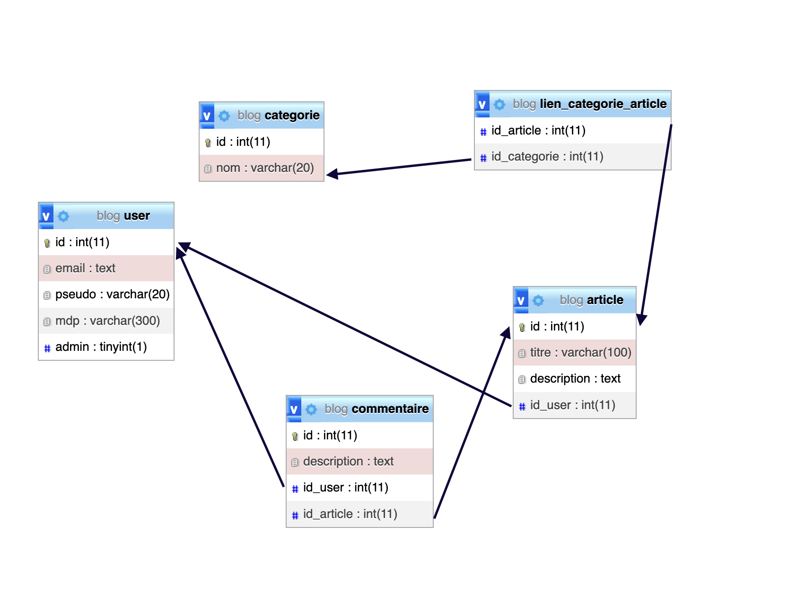

# BLOG PHP - Tp noté
## Table des Matières
## Table des Matières

1. [Intro / Contexte](#intro--contexte)
2. [Présentation rapide de la Base de Données](#présentation-rapide-de-la-base-de-données)
3. [Présentation du Code](#présentation-du-code)
    - [Découpage](#découpage)
    - [Fonctions](#fonctions)
3. [Améliorations possibles](#améliorations-possibles)

## Intro / Contexte
Le projet vise à créer une application web de type "Blog". Ce projet comprend plusieurs fonctionnalités comme la connexion utilisateur, la liste et création d'articles, la gestion des catégories, etc.

### Accessibilité

Nous avons pris plusieurs mesures pour rendre notre site accessible :

- Utilisation de balises HTML sémantiques pour aider les lecteurs d'écran à naviguer plus facilement sur le site.
- Contraste élevé entre le texte et l'arrière-plan pour faciliter la lecture.
- Testé pour l'accessibilité sur différents navigateurs.

### Gestion des Erreurs

Une autre priorité a été la robustesse de l'application, notamment en ce qui concerne la gestion des erreurs :

- Messages d'erreur clairs et descriptifs en cas de problèmes, aidant ainsi l'utilisateur à comprendre ce qui ne va pas et comment le corriger.
- Validation côté serveur en plus de la validation côté client pour une sécurité accrue.

En résumé, ce projet vise à créer un blog accessible, robuste et convivial, en mettant l'accent sur une expérience utilisateur exceptionnelle.

## Présentation rapide de la Base de Données
Nous avons utilisé une base de données MySQL qui comprend les tables suivantes :

* User: Stocke les informations des utilisateurs
* Article : Contient les articles publiés
* Categories : Pour les différentes catégories d'articles
* Lien_categorie_article : Lie chaque article à ses catégories attribuées (s'il en a)
* Commentaire : Contient les commentaires publiés, avec l'information de l'article auquel il correspond

## Présentation du code
Nous avons rendu notre code accessible et lisible en divisant au maximum ses fichiers et ses fonctions.

### Découpage
Après le fichier **index.html**, qui est la page d'accueil, nous avons divisé le code en 3 répertoires :
* Pages : Les différentes pages du site, qui sont visibles et navigables par l'utilisateur. Ses fichiers contiennent du code HTML en plus du PHP.
* Structure : Le header et le footer du site, qui sont intégrés à chaque page.
* Traitement : Les fonctions du site qui sont appelées par les pages pour effectuer des tâches non visibles par l'utilisateur.

Dans le dossier **traitement**, on trouve plusieurs fichiers qui correspondent à différentes fonctionnalités :
* **auth.php** : Gère la connexion au site et la création de compte.
* **config.php** : Connecte la base de données, le fichier est inclus dans toutes les pages / fonctions qui ont un lien avec la base de données.
* **deconnexion.php** : Déconnecte l'utilisateur en détruisant sa session.
* **require_auth.php** : Regarde si l'utilisateur est connecté, et le renvoie sur la page d'accueil si ce n'est pas le cas. On utilise ce fichier au début de toutes les pages pours lesquelles il faut être connecté.
* **sql.php** : Contient toutes les fonctions qui interargissent directement avec la base de données en lui effectuant des requêtes SQL.
* **traitement_forms.php** : Reçoit les formulaires envoyés depuis tout le site et contient les traitement à faire en fonction de ces demandes.

### Fonctions
Les fonctions principales sont dans le fichier **sql.php**.
On y retrouve les fonctions :
* **delete_article_from_id** : Supprime l'article d'ID donné.
* **get_user_by_id** : Récupère les informations d'un compte depuis son ID.
* **get_articles** :  Récupère tous les articles de la base de données, du plus récent au plus ancien.
* **get_articles_from_categories_and_titre_and_auteur** : Permet la recherche filtrée, renvoie les articles avec au moins une des catégories données, et avec soit l'auteur soit le titre qui contient la chaîne de caractère donnée en paramètre.
* **get_article** : Récupère un article depuis son ID.
* **nvarticle** : Créé un article avec les propriétés données en paramètre.
* **get_user_by_email** : Récupère un utilisateur depuis son adresse mail, utilisé pour reconnaître l'utilisateur à la connexion.
* **get_categories** :Récupère toutes les catégories de la base.
* **get_categorie_by_name** : Récupère une catégorie depuis son nom exact, est utilisé lors de la création de catégorie pour éviter d'en avoir en double.
* **create_user** : Créée un nouveau profil dans la base de données.
* **create_categorie** : Créée une catégorie de nom donné.
* **ajout_commentaire** : Met un commentaire lié à un article.
* **delete_commentaire** : Supprime un commentaire depuis son ID.
* **get_commentaires_article** : Récupère la liste des commentaires liés à un article depuis son ID.
* **set_pseudo** : Prend l'utilisateur d'ID donné et lui attribut le pseudo demandé.
* **delete_categorie** : Supprime la catégorie d'ID donné.

## Améliorations possibles
Dans le cas où nous continuons de développer le site, nous aimerions faire les ajouts suivants :
* Système de réponse aux commentaires.
* Système de vote / avis sur un article pour le mettre en avant.
* Personnalisation plus poussée du profil.
* Pouvoir s'abonner un auteur d'articles.
* Pouvoir rédiger ses articles en MarkDown et qu'ils s'affichent proprement.